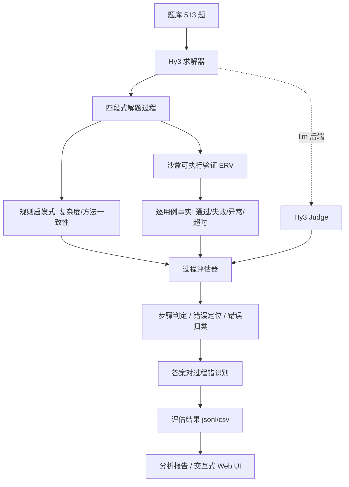

# AlgoJudge-Hy3: Process-Guided Algorithm Problem Evaluation & Error Localization

**面向算法竞赛题求解的过程评估、错误定位与可验证评测系统**

AlgoJudge-Hy3 是一个面向算法题求解的可验证 Hy3 应用。传统评测只判定最终答案对错，无法区分「蒙对」与「真懂」；本系统让 **Hy3 产出完整解题过程**，再用**沙盒可执行验证 + 规则/LLM 双后端过程评估**判定推理链是否成立：定位首个错误步骤、归纳错误类型，并识别「答案正确但过程不成立」的样本。

题库 **513 道全部来自 LeetCode 官方**：题目（标题/难度/样例/约束）取自官方题库 API，标准答案取自**官方题解文章中的 Python 代码**（仅加 stdin/stdout I/O 适配，不含任何自编算法逻辑），官方样例自洽 **513/513**，官方元数据交叉校验通过（难度一致、付费题 0）。

本仓库当前定位为**方案文档仓库**：完整设计思路、架构、重点技术与时间规划见 **[方案文档.md](./方案文档.md)**；完整实现代码（题库、评估器、评测脚本、Web UI）位于本地开发仓库，按需另行提交。

## Abstract

Algorithm problem evaluation cannot be judged by final answers alone: a candidate may pass weak sample cases while failing on boundaries, or return a correct answer backed by an invalid reasoning chain (e.g., a complexity claim contradicted by the implementation). AlgoJudge-Hy3 defines the evaluation as an auditable three-layer loop — **Hy3 solves → sandbox executes → process evaluator judges** — and combines real official testcases, static claim-vs-implementation consistency checks, differential stress testing, and an optional LLM-as-judge backend to decide process validity step by step.

## Contributions

- **真实题库（500+）**：513 道 LeetCode 官方题（easy 168 / medium 180 / hard 165，12 算法域 × 3 难度），题目与标准答案均来自官方，杜绝自编。
- **三层可验证闭环**：Hy3 求解 → 沙盒可执行验证（ERV）→ 过程评估器，所有判定建立在可复现的执行事实之上。
- **错误步骤定位**：解答过程固定拆为 4 步（思路/复杂度/边界/代码），定位首个错误步骤，与人工标注对齐。
- **错误类型归类**：可操作分类体系（logic / complexity / concept / boundary / hallucination 等），细类→粗类映射。
- **「答案对、过程错」识别**：复杂度声称与实现矛盾、声称方法与实现不符等 false-validity 样本检测。
- **rule / llm 双后端**：离线确定性规则后端（演示/CI 默认）+ Hy3 LLM-as-judge 后端（生产推荐），接口一致可对照。
- **差分压力测试（deep-ERV）**：以官方参考解为 oracle 生成压力输入，捕捉「主测试集巧合通过」的样本。
- **少量题实时演示接口**：`--limit N` / `--ids`，避免 Hy3 输出全量题库，演示现场按需出题。

## 1. 系统架构

```text
algo-process-eval/                 # 完整实现（本地开发仓库，本 GitHub 仓库仅含方案文档）
├── src/
│   ├── solver.py                  # Hy3 求解：四段式解题过程（思路/复杂度/边界/代码）
│   ├── sandbox.py                 # 受限沙盒执行：子进程 + 超时 + 导入白名单，逐用例 verdict
│   ├── process_evaluator.py       # 过程评估：步骤判定、错误定位、错误归类（rule + llm 编排）
│   ├── hy3_client.py              # Hy3 客户端：OpenAI 兼容/腾讯云双通道，无凭证自动降级 Mock
│   ├── taxonomy.py                # 错误分类体系：枚举、粗类映射、可判定信号
│   ├── problems.py                # 题目模型与答案校验（check_mode：int/list/bool/token 等）
│   ├── runlog.py                  # 全量日志留存：Hy3 原始回答 + 判定依据（append-only）
│   └── verdict.py
├── data/
│   ├── problems.json              # 513 道 LeetCode 官方真实题（题目/答案/样例/来源链接）
│   ├── samples.json               # 15 个评测样本（含人工真值：正确/错误/复杂度错/误报）
│   └── leetcode_meta.json         # 官方元数据（真实性交叉校验用）
├── eval/
│   ├── run_eval.py                # 端到端评估（samples/live；rule/llm；deep-ERV；少量题接口）
│   ├── run_full.py                # 全量跑批：求解→评估→汇总（分阶段缓存，断点续跑）
│   ├── verify_evaluator.py        # 评估器有效性验证（定位准确率/误报率）
│   ├── logs/                      # 全量日志：solve_trace/eval_trace.jsonl + 人可读 md
│   └── report.py                  # 分析报告
├── tools/
│   ├── gen_problems.py            # 聚合 pbank 模块 → problems.json
│   ├── verify_all.py              # 题库自检（513/513）
│   ├── gen_demo.py                # 数据驱动交互式 Web UI
│   ├── gen_dashboard.py           # 全量指标看板（demo/dashboard.html）
│   ├── gen_full_report.py         # 全量评测报告（Markdown）
│   ├── gen_run_logs.py            # 渲染全量日志（Hy3 原始回答 + 判定过程）+ 缓存补导出
│   ├── preflight_consistency.py   # 预检：判定一致性不变量（真实数据，不写正式缓存）
│   ├── diagnose_api.py            # 诊断网关失败原因（超时/限流/content 为空）
│   ├── check_dashboard.js         # 看板自检：DOM 桩真实执行渲染脚本（CI 可用）
│   ├── gen_stress.py              # 差分压力输入生成（deep-ERV 数据）
│   └── fetch/                     # 真实数据流水线（LeetCode 官方 API + 官方题解抓取）
├── tests/                         # pytest 测试套件（题库/参考解/评估器/样本/端到端 smoke）
├── pyproject.toml                 # 项目元数据与 pytest 配置
├── .github/workflows/ci.yml       # GitHub Actions CI（push 自动跑测试）
└── demo/
    ├── index.html                 # 交互式 UI：题目目录 + 评测结果 + 过程热力
    └── dashboard.html             # 全量评测看板：513 题指标 + 逐题明细
```

本 GitHub 仓库内容：

```text
algo-process-eval-plan/
├── README.md          # 本文档（方案门户）
└── 方案文档.md         # 完整方案：设计思路/架构/重点技术/预期效果/时间规划
```

## 过程总览



硬门禁顺序：**沙盒官方用例 → 复杂度/方法一致性 → 错误定位 → 过程有效性**。答案错误必然定位到代码实现步骤；答案正确但复杂度声称与实现矛盾（如声称 O(n) 而代码双层循环）则判定 `complexity_error`，即「答案对、过程错」。

## 2. 已完成能力

### 题库（513 题）

12 个算法域 × 3 档难度，每桶约 15 题，难度均衡（easy 168 / medium 180 / hard 165）：

数组/哈希 · 字符串 · 二分查找 · 双指针/滑动窗口 · 链表 · 数学 · 树 · 图 · 动态规划 · 堆/贪心 · 栈/队列 · 回溯/位运算

### 数据与真实性

| 校验项 | 结果 |
|---|---|
| 题目与答案来源 | LeetCode 官方（题目 API + 官方题解文章） |
| 官方样例自洽 | **513/513** 全部通过（参考解自验） |
| 官方元数据交叉校验 | 469 题精确匹配（难度一致、付费题 0）；44 题为 LCR/剑指 Offer/竞赛题（实时 API 确认真实） |
| 来源可追溯 | 每题含官方 `problem_url` / `solution_url` |

### 过程评估

- 解答过程固定 4 步骤：`1=思路/建模`、`2=复杂度分析`、`3=边界与处理`、`4=代码实现`。
- 规则后端：复杂度声称 vs 循环嵌套检测、方法-实现一致性检测、沙盒事实驱动。
- LLM 后端：Hy3 逐步裁判，输入含沙盒逐用例事实（金标准），支持自一致性多数投票（`--judge-samples N`）。

### 少量题实时演示接口

```bash
python eval/run_eval.py --source live --backend llm --limit 3          # 随机 3 题实时求解
python eval/run_eval.py --source live --backend llm --ids AE01 ME02    # 指定题
python eval/run_eval.py --source live --backend llm --limit 5 --seed 1 # 固定种子可复现
```

## 3. 快速开始

```bash
pip install -r requirements.txt

# 运行测试套件（pytest：题库/参考解/评估器/样本/端到端 smoke）
python -m pytest -q

# 题库自检（513/513）
python tools/verify_all.py

# 离线端到端评估（rule 后端，无需 API）
python eval/run_eval.py --source samples --backend rule

# 差分压力测试（deep-ERV：以参考解为 oracle，逐压力用例差分比较）
python eval/run_eval.py --source samples --backend rule --deep-erv

# 评估器有效性验证（定位准确率 / 误报率）
python eval/verify_evaluator.py

# 生成分析报告与交互式 Web UI
python eval/report.py
python tools/gen_demo.py        # -> demo/index.html（题目目录 + 样本探查）

# 全量跑批：Hy3 求解 513 题 + 沙盒验证 + 过程评估（分阶段缓存，可断点续跑）
python eval/run_full.py --workers 6 --eval-workers 6 --deep-erv
python tools/gen_dashboard.py   # -> demo/dashboard.html（全量指标看板）
python tools/gen_full_report.py # -> 全量评测报告.md
python tools/gen_run_logs.py    # -> eval/logs/*.md（Hy3 原始回答 + 判定过程全量日志）
node tools/check_dashboard.js   # 看板自检：真实执行渲染脚本，逐容器校验

# 重新生成题库（聚合 pbank → problems.json → 自动挂载压力输入）
python tools/gen_problems.py

# Hy3 实时演示（配好 .env 的 HY3_API_KEY 后）
python eval/run_eval.py --source live --backend llm --limit 3
```

## 4. 评估器有效性（rule 后端 + 诊断样本集实测）

| 指标 | 结果 |
|---|---|
| 错误定位准确率 | **100%**（5/5 命中，错误类型与步骤全部正确） |
| 误报率 | **0.0%**（10 个正确样本无一误判） |
| 最终答案准确率 | 66.7%（样本集刻意含难例/反例，用于验证判别力） |
| 过程正确率 | 46.7%（识别出「答案对过程错」样本） |

> 说明：准确率/过程正确率针对诊断样本集，样本设计时故意混入大量错误样本用于验证评估器判别力，不代表真实求解水平。

## 5. 全量评测看板（Web 端指标展示）

`python tools/gen_dashboard.py` 生成自包含单文件 `demo/dashboard.html`（零外部依赖，离线可双击打开），
把全量 513 题的评测结果按 11 个维度呈现：

| 模块 | 呈现的指标 |
|---|---|
| 核心 KPI | 已评测题数 / 覆盖率、答案正确率、过程正确率、**答案对但过程错**、答案错误、单题生成与评估耗时中位 |
| 难度分层 | Easy/Medium/Hard 各自的「答案正确率 vs 过程正确率」双柱对比，柱差即该档难度的隐蔽比例 |
| 算法域分层 | 12 个算法域的双指标叠加条，按答案正确率降序 |
| 错误类型分布 | 过程不成立题目的细类归因（逻辑/复杂度/概念/边界…） |
| 错误首次出现步骤 | 四步骤定位分布（step1 思路 / step2 复杂度 / step3 边界 / step4 代码） |
| 沙盒执行 verdict | ERV 逐用例 AC/WA/TLE/RE/CE 聚合，以及按题去重的「首次失败 verdict」 |
| **四步骤逐级通过率** | 把每题过程判定按四步骤拆开，看推理链在哪一步开始崩、累计失守多少题 |
| **难度 × 错误类型交叉** | 热力表定位「哪一档难度易犯哪类错」 |
| **算法域「答案对但过程错」集中度** | 该域内推理链不成立却通过官方用例的占比，越高说明传统判题越不可靠 |
| 效率指标 | 单题生成耗时（中位/均值/最快/最慢）与评估耗时，全量累计耗时 |
| 增量价值构成 | 传统判题只能区分「答案对/错」，本系统把其中一部分单独识别为「过程不成立」 |
| 逐题明细 | 513 题可筛选（结果/难度）、可搜索、可展开查看 Hy3 四段式过程、生成代码、步骤级判定与 verdict |

**看板自检**：`node tools/check_dashboard.js demo/dashboard.html` 用最小 DOM 桩真实执行页面渲染脚本，
逐容器校验是否被填充、是否有渲染函数抛错。`node --check` 只能验证语法，无法发现「数据缺字段导致白屏」这类
运行时问题——该自检把渲染逻辑真正跑一遍，可接入 CI。

### 步骤判定与总体判定的一致性约束

步骤级判定（`step_verdicts`）在失败归因之前生成，只有复杂度冲突会即时回写。这会导致「总体判定为过程不成立、
但 `error_step` 指向的那一步仍显示『无明显问题』」的自相矛盾——在看板上表现为**「四步全绿却判定失败」**，
直接损害结果可信度。为此在 `src/process_evaluator.py` 中引入 `_align_step_verdicts()`，在 rule 与 llm 两个后端
返回前统一对齐：

> 不变量：`process_valid == False` ⟺ 存在被标记为失败的步骤，且 `error_step` 必落在该集合内。

该不变量由 `tests/test_evaluator.py::test_step_verdicts_consistent_with_overall_verdict` 锁定。

## 6. 全量日志留存（可追溯性）

跑批过程中，求解与评估的**输入输出全量落盘**，用于事后复核与问题定位：

| 文件 | 内容 |
|---|---|
| `eval/logs/solve_trace.jsonl` | 每题一行：完整 prompt、逐次尝试的状态/耗时/失败原因、终态原始回答 |
| `eval/logs/eval_trace.jsonl` | 每题一行：题目上下文、逐用例 verdict、四步骤判定、错误归因、压力测试、被评估的原始回答 |
| `eval/logs/hy3_原始回答日志.md` | 人可读版：含目录、统计概览、**Hy3 原始回答全文**、完整提示词 |
| `eval/logs/过程评估判定日志.md` | 人可读版：逐用例 verdict 表、四步骤判定表、错误归因、判定一致性自检 |

两个关键取舍：

- **成功与失败都记**。断点续跑缓存（`hy3_solutions.jsonl`）只存成功结果，因为它只服务于「不重复烧 API」；
  而失败记录（Mock 降级 / 超时 / 空响应）恰恰是回答「为什么某题跑不出来、该调并发还是调超时」的唯一依据。
  日志中若缺了 prompt，就无法证明模型是在「只有题面、没有答案」的条件下作答，可追溯性无从谈起。
- **append-only + 逐行 flush**。数小时的长任务随时可能被中断，逐行追加的 jsonl 即使进程被杀，
  已写记录依然完整可读（读取侧另有残行容忍）。

`python tools/gen_run_logs.py` 负责渲染人可读日志，并把已有解答缓存**补导出**为 trace 记录
（标记 `backfilled=true`），使日志覆盖全量题目而无需重跑烧 API。

## 7. Hy3 接入边界

1. `src/hy3_client.py` 提供 OpenAI 兼容（TokenHub）与腾讯云 Hunyuan SDK 双通道；API key 只放 `.env`，凭证缺失自动降级离线 Mock，流程不中断。
2. `src/solver.py` 按固定模板让 Hy3 输出四段式解题过程（思路/复杂度/边界/可运行代码），`parse_solution` 解析为结构化 `Solution`。
3. `eval/run_eval.py --backend llm` 让独立的 Hy3 Judge 审查四步骤，输入包含沙盒逐用例执行事实（金标准），输出逐步判定结论。
4. 少量题接口（`--limit`/`--ids`）控制演示成本，避免 Hy3 输出全量 513 题。

## 8. 当前限制

- `llm` 后端为 LLM-as-judge，判定存在随机性——已用自一致性多数投票缓解，并始终以 rule 后端作为离线对照。
- 题库少数桶不足 15 题（如 hard 链表 4、easy 图 6）为 LeetCode 免费题库该域题量的硬上限，全部候选均已抓取验证。
- `data/leetcode_meta.json` 为 2023 年快照，44 道 LCR/剑指 Offer/竞赛题不在其中；这些题均经实时官方 API 验证真实存在，难度由官方数据源直接给出。
- 差分压力输入覆盖 379/513 题（73%）；其余为设计类（操作序列）或官方参考解对约束外输入脆弱的题，压力输入不挂载（deep-ERV 对该部分题自动降级为仅主测试集）。

## 9. 验证

```text
pytest 测试套件   40 passed（题库/参考解/包装/评估器/样本/跑批/端到端 smoke）
题库自检       513/513 通过（tools/verify_all.py）
评测样本自洽   15/15（tools/fetch/gen_samples2.py 生成并自检）
评估器有效性   定位准确率 100% / 误报率 0%（eval/verify_evaluator.py）
deep-ERV      379/513 题挂载压力输入，stress_summary 逐样本输出差分结果
端到端评估     samples+rule / live+llm / deep-ERV 全部可运行
看板自检       tools/check_dashboard.js：13 个容器全部渲染正常（DOM 桩真实执行渲染脚本）
判定一致性     步骤级判定与总体判定对齐，由回归测试锁定不变量
CI            GitHub Actions：push 自动跑 pytest + 题库加载检查
```

详细设计、错误分类体系、重点技术与时间规划见 **[方案文档.md](./方案文档.md)**。
