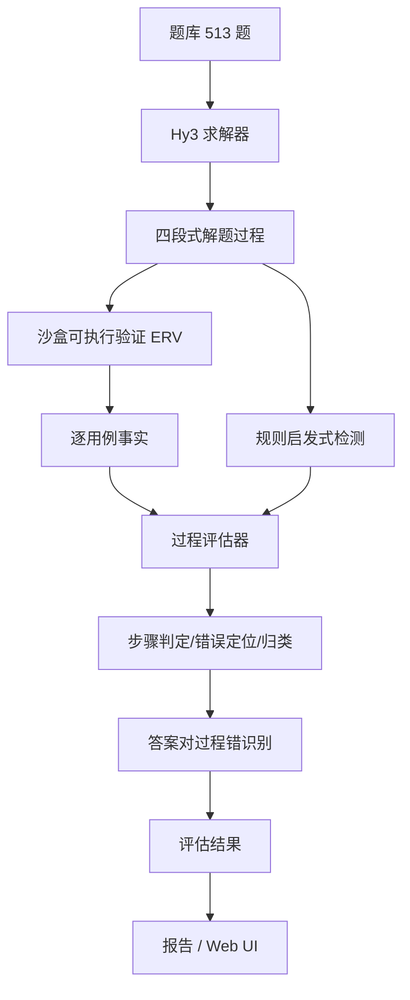

# 方案文档：AlgoJudge-Hy3 — 算法题「过程评估与错误定位」系统

> 犀牛鸟开源实战 · 任务二（可验证场景：过程评估与错误定位）· 算法题方向
> 个人/活动作品，非腾讯官方发布。模型能力调用通过 **Hy3** 完成，无需训练或微调。

## Abstract

Algorithm problem evaluation cannot be judged by final answers alone. A candidate may pass weak sample cases while violating its claimed complexity, miss boundaries, or return a correct answer backed by an invalid reasoning chain. AlgoJudge-Hy3 defines the evaluation as an auditable three-layer loop — **Hy3 solves → sandbox executes → process evaluator judges** — and combines real official testcases, static claim-vs-implementation consistency checks, differential stress testing, and an optional LLM-as-judge backend to decide process validity step by step, locate the first erroneous step, and classify the error.

## Contributions

- **真实题库（500+）**：513 道 LeetCode 官方题（easy 168 / medium 180 / hard 165，12 算法域 × 3 难度），题目与标准答案均来自官方，杜绝自编。
- **三层可验证闭环**：求解 → 沙盒可执行验证（ERV）→ 过程评估，所有判定建立在可复现执行事实之上。
- **错误步骤定位**：解答过程固定拆为 4 步（思路/复杂度/边界/代码），定位首个错误步骤。
- **错误类型归类**：可操作分类体系（logic / complexity / concept / boundary / hallucination 等），细类→粗类映射。
- **「答案对、过程错」识别**：复杂度声称与实现矛盾、声称方法与实现不符等 false-validity 检测。
- **rule / llm 双后端**：离线确定性规则后端 + Hy3 LLM-as-judge 后端，接口一致可对照。
- **差分压力测试（deep-ERV）**：官方参考解为 oracle 的压力输入，捕捉「巧合通过」样本。
- **少量题实时演示接口**：`--limit` / `--ids`，演示现场按需出题。

---

## 1. 项目背景与目标

### 1.1 背景

传统算法题评测（Online Judge）只判定**最终答案**：提交代码、跑测试数据、给 AC/WA。两大局限：

1. **无法区分「蒙对」与「真懂」**：靠猜测、巧合或弱测试用例侥幸通过的答案，与严谨推导的答案在传统评测中无区别。
2. **无法定位错误、无法反馈过程**：错了只知道「错了」，不知道错在哪一步、属于哪类错误，无法支撑 AI 应用调试。

### 1.2 目标

| 目标 | 说明 |
|---|---|
| 可验证性 | 判定结论建立在**沙盒可执行验证（ERV）**之上，可复现、可审计 |
| 过程级评估 | 四步固定拆解，逐步骤判定并定位首个错误步骤 |
| 错误归类 | 可操作分类体系（逻辑/复杂度/概念/边界/幻觉等） |
| 「答案对、过程错」识别 | 识别答案正确但推理链不成立的样本 |
| 真实题库 | 500+ 道真实题，题目与答案均来自 LeetCode 官方 |

---

## 2. 设计思路

### 2.1 核心思想：三层可验证闭环

```
        ┌─────────────┐    ┌─────────────┐    ┌──────────────────┐
题目 ──▶│  求解器      │───▶│  沙盒校验    │───▶│  过程评估器       │
        │ (Hy3 生成    │    │ (执行代码,   │    │ (rule/llm 双后端, │
        │  完整解题过程)│    │  判定答案)   │    │  步骤判定/错误定位)│
        └─────────────┘    └─────────────┘    └──────────────────┘
                                                      │
                                                      ▼
                                          报告 / 可视化 / 有效性验证
```

- **求解层**：Hy3 按固定模板产出四段式解题过程——思路/建模、复杂度分析、边界与处理、可运行代码。产出完整推理链，而非仅最终答案。
- **校验层**：代码在受限沙盒子进程执行（超时 + 受限导入），跑官方测试用例，得到**逐用例真实判定事实**（通过/失败/异常/超时），作为评估唯一事实来源。
- **评估层**：结合沙盒事实与规则启发式（或 LLM-as-judge），对四步骤逐项判定，定位首个错误步骤、归纳错误类型，识别「答案正确但过程不成立」样本。

### 2.2 关键设计决策

1. **事实优先于观点**：`final_correct` 由沙盒执行决定；`process_valid` 由「声称 vs 实现」的客观矛盾检测决定（复杂度声称与循环嵌套不符、声称哈希但代码未用哈希）。LLM 裁判先看到沙盒事实再下判断。
2. **双后端可切换**：`rule`（规则+沙盒，离线确定性，演示/CI 默认）与 `llm`（Hy3 逐步 LLM-as-judge，生产推荐），接口一致。
3. **自一致性多数投票**：`--judge-samples N` 多次采样多数投票，降低判定随机性。
4. **差分压力测试（deep-ERV）**：以官方参考解为 oracle 生成压力输入，捕捉「主测试集巧合通过、压力测试暴露本质」样本。
5. **真实性不可妥协**：题目与标准答案全部来自 LeetCode 官方，官方元数据交叉校验。

---

## 3. 系统架构

### 3.1 模块划分

| 模块 | 文件 | 职责 |
|---|---|---|
| 求解器 | `src/solver.py` | 组装题目上下文，调用 Hy3 生成四段式解题过程，解析为结构化 `Solution` |
| 沙盒校验器 | `src/sandbox.py` | 子进程+超时执行解法，受限导入白名单，产出逐用例 verdict |
| 过程评估器 | `src/process_evaluator.py` | 规则评估器（步骤判定/错误定位/归类）；LLM 裁判编排 |
| Hy3 客户端 | `src/hy3_client.py` | OpenAI 兼容（TokenHub）/腾讯云 SDK 双通道；无凭证自动降级 Mock |
| 错误分类体系 | `src/taxonomy.py` | 错误类型枚举、细类→粗类映射、可判定信号 |
| 题库 | `data/problems.json` | 513 道 LeetCode 官方真实题（题目/答案/样例/来源链接） |
| 评测样本 | `data/samples.json` | 15 个含人工真值的评测样本（正确/错误/复杂度错/误报） |
| 评测脚本 | `eval/run_eval.py` 等 | 端到端评测、有效性验证、分析报告 |
| 真实数据流水线 | `tools/fetch/` | LeetCode 官方 API 抓取题目 + 官方题解代码，构建题库 |
| 可视化 | `tools/gen_demo.py` | 数据驱动交互式 Web UI |

### 3.2 数据流



### 3.3 错误定位步骤约定

| 步骤编号 | 步骤名 | 判定要点 |
|---|---|---|
| 1 | 思路/建模 | 算法选择是否成立、建模是否正确 |
| 2 | 复杂度分析 | 复杂度声称与代码实现是否矛盾 |
| 3 | 边界与处理 | 空输入、单元素、极端值等边界是否覆盖 |
| 4 | 代码实现 | 代码能否通过沙盒官方用例（可执行事实） |

---

## 4. 重点技术

### 4.1 可执行验证（ERV）与差分压力测试

- 解法代码在受限沙盒中独立子进程执行（超时 + 标准库导入白名单），杜绝越权。
- 主测试集为 LeetCode 官方样例，判定真实答案正确性。
- **deep-ERV**：官方参考解作为 oracle，自动生成大输入压力数据，捕捉「巧合通过」（只对样例规模有效、真实复杂度退化）样本。当前 363/513 题（71%）已挂载压力输入，其余为设计类（操作序列）或官方参考解对约束外输入脆弱的题。

### 4.2 规则启发式过程判定（rule 后端）

- **复杂度一致性检测**：解析推理文本复杂度声称（如 `O(n)`），与代码实际循环嵌套层数比对，不一致则判定复杂度分析步骤不成立。
- **方法-实现一致性检测**：声称使用哈希/字典而代码无对应结构，判定概念/方法名实不符。
- **沙盒事实驱动**：答案错误定位到代码实现步骤；结合压力测试结果细化错误性质。

### 4.3 LLM-as-Judge（llm 后端）

- Hy3 作为逐步裁判，输入：题目、模型解题过程、沙盒逐用例执行事实（金标准），输出四步骤判定。
- 支持自一致性多数投票，提升判定稳定性。
- 与 rule 后端结果可在 UI 对照，展示一致性分析。

### 4.4 真实数据流水线（题库建设）

- **题目**：LeetCode 中国站官方 GraphQL API（标题/难度/描述/官方样例/约束）。
- **答案**：官方题解文章中的 Python 代码，仅附加 stdin/stdout I/O 适配层，**不含任何自编算法逻辑**。
- **测试用例**：官方样例，期望值由官方题解代码运行产生（真实且自洽）。
- **交叉校验**：官方元数据比对（难度一致、付费题 0），每题含 `problem_url` / `solution_url`。

### 4.5 少量题实时演示接口

```bash
python eval/run_eval.py --source live --backend llm --limit 3          # 随机 3 题
python eval/run_eval.py --source live --backend llm --ids AE01 ME02    # 指定题
python eval/run_eval.py --source live --backend llm --limit 5 --seed 1 # 固定种子可复现
```

避免 Hy3 输出全部 513 题答案，演示现场按需出题。

---

## 5. 数据与真实性保障

### 5.1 题库规模与分布

- **总量**：513 题（easy 168 / medium 180 / hard 165）。
- **域覆盖**：12 算法域 × 3 难度（数组/哈希、字符串、二分查找、双指针/滑动窗口、链表、数学、树、图、动态规划、堆/贪心、栈/队列、回溯/位运算），每桶约 15 题。

### 5.2 真实性保障

| 校验项 | 结果 |
|---|---|
| 题目与答案来源 | LeetCode 官方（题目 API + 官方题解文章） |
| 官方样例自洽 | **513/513** 全部通过（参考解自验） |
| 官方元数据交叉校验 | 469 题精确匹配（难度一致、付费题 0）；44 题为 LCR/剑指 Offer/竞赛题（实时 API 确认真实） |
| 来源可追溯 | 每题含官方题目链接与官方题解链接 |

### 5.3 评测样本集（含人工真值）

15 个样本：正确且过程成立（真负例）、答案错误（定位错误步骤与类型）、答案正确但过程不成立（复杂度声称与实现不符）、易误报样本，用于评估器有效性验证（定位准确率/误报率）。

---

## 6. 预期效果

### 6.1 评估器有效性（rule 后端 + 诊断样本集实测）

| 指标 | 结果 |
|---|---|
| 错误定位准确率 | **100%**（5/5 命中，错误类型与步骤全部正确） |
| 误报率 | **0.0%**（10 个正确样本无一误判） |
| 最终答案准确率 | 66.7%（样本集刻意含难例/反例，用于验证判别力） |
| 过程正确率 | 46.7%（识别出「答案对过程错」样本） |

> 说明：准确率/过程正确率针对诊断样本集，样本设计故意混入大量错误样本验证评估器判别力，不代表真实求解水平。

### 6.2 交付物

- 513 题真实题库（`data/problems.json`，含来源链接与标准答案）
- 端到端评测脚本与报告（`eval/`）
- 评估器有效性验证报告（`eval/results/verification.json`、`REPORT.md`）
- 数据驱动交互式 Web UI（`demo/index.html`：题目目录 + 评测结果 + 过程步骤热力 + rule/llm 对比）

---

## 7. 时间规划

| 阶段 | 主要工作 | 周期 |
|---|---|---|
| 1. 需求与方案设计 | 场景选择（算法题）、过程评估方法设计、错误分类体系设计 | 1 周 |
| 2. 题库建设 | 真实数据流水线；抓取 LeetCode 官方题目与官方题解；513 题题库；难度/域均衡；真实性交叉校验 | 2 周 |
| 3. 核心引擎 | 沙盒校验器；rule 过程评估器；Hy3 客户端与降级 | 2 周 |
| 4. LLM 评估与增强 | LLM-as-judge 后端；自一致性多数投票；deep-ERV 差分压力测试 | 1 周 |
| 5. 验证与调优 | 样本集标注；评估器有效性验证；错误判定调优 | 1 周 |
| 6. 演示与交付 | 交互式 Web UI；少量题实时演示接口；分析报告 | 1 周 |

**合计约 8 周**（可压缩至 5~6 周：题库与核心引擎并行，LLM 评估与演示 UI 提前并行）。

---

## 8. 风险与对策

| 风险 | 对策 |
|---|---|
| 大模型求解质量不稳定 | 求解端接入 Hy3 高推理强度；评估端以沙盒事实为准，不依赖模型自述 |
| 官方题解语言/格式不统一 | 自动提取 Python 代码并做 I/O 适配；设计类/特殊类单独处理；构建失败自动换题 |
| LLM 裁判判定漂移 | 自一致性多数投票；裁判先看沙盒事实；rule 后端作为离线对照 |
| 演示成本（Hy3 输出全量题库） | `--limit`/`--ids` 少量题接口，按需实时求解 |
| API 凭证缺失 | 自动降级离线 Mock，流程不中断 |

---

## 9. 当前限制

- `llm` 后端判定存在随机性——自一致性多数投票缓解，始终以 rule 后端为离线对照。
- 少数桶不足 15 题（hard 链表 4、easy 图 6 等）为 LeetCode 免费题库该域题量硬上限，全部候选均已抓取验证。
- `leetcode_meta.json` 为 2023 年快照，44 道 LCR/剑指 Offer/竞赛题不在其中；均经实时官方 API 验证真实。
- 本 GitHub 仓库仅含方案文档；完整实现代码位于本地开发仓库，按需另行提交。

---

## 10. 验证

```text
pytest 测试套件   19 passed（题库/参考解抽样/评估器单元/样本真值/端到端 smoke）
题库自检       513/513 通过（tools/verify_all.py）
评测样本自洽   15/15（tools/fetch/gen_samples2.py 生成并自检）
评估器有效性   定位准确率 100% / 误报率 0%（eval/verify_evaluator.py）
deep-ERV      363/513 题挂载压力输入，stress_summary 逐样本输出差分结果
端到端评估     samples+rule / live+llm / deep-ERV 全部可运行
Web UI         demo/index.html（513 题 + 15 样本 + rule/llm 结果）
CI             GitHub Actions：push 自动跑 pytest + 题库加载检查
```

**入口：[README.md](./README.md) · 完整实现位于本地开发仓库。**
